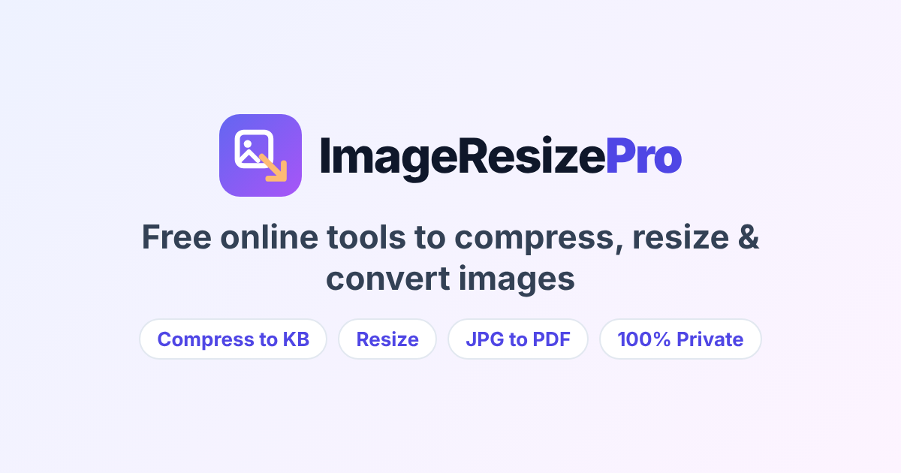

# ImageResizePro

**Free, fast and private online image tools — everything runs in the browser, nothing is uploaded.**

ImageResizePro is a static website with 50+ SEO landing pages for the image tasks people search for most: compress an image to 20 KB, resize a photo for an exam form, convert JPG to PDF, PNG to JPG, HEIC to JPG and more.



## Tools

| Category | Tools |
| --- | --- |
| **Compress** | Compress Image (quality or exact KB target), Compress to 10 / 20 / 30 / 50 / 100 / 200 / 500 KB |
| **Resize** | Resize Image (pixels, %, presets), Instagram, YouTube thumbnail, WhatsApp DP, Facebook, LinkedIn banner, Photo & Signature Resizer for exam forms, Signature Resizer, Passport Size Photo Maker |
| **Convert** | Image Converter, PNG↔JPG, WebP→JPG/PNG, JPG/PNG→WebP, PNG/JPG→ICO, AVIF→JPG, HEIC→JPG/PNG |
| **PDF** | Image to PDF, JPG to PDF, PNG to PDF, PDF to JPG, PDF to PNG |
| **Edit** | Crop, Circle Crop, Rotate, Flip, Watermark (text/logo/tiled), Photo Filters, Black & White, Blur, Merge Images |
| **Utilities** | Color Picker from Image, Image ⇄ Base64, Favicon Generator, Remove EXIF / GPS data |

## Highlights

- **100% client-side** — Canvas API, PDF.js, jsPDF, JSZip and heic2any are self-hosted in `assets/vendor/`. No server, no uploads.
- **SEO-first** — one static HTML page per keyword with unique title, meta description, canonical URL, Open Graph tags, `WebApplication`, `HowTo`, `FAQPage` and `BreadcrumbList` structured data, internal "related tools" links, `sitemap.xml` and `robots.txt`.
- **AdSense-ready** — ad slots on every page, plus About, Contact, Privacy Policy (with the required Google advertising cookie disclosure), Terms and Disclaimer pages.
- **Easy to use** — every tool is *upload → one button → download*, with extra settings tucked away under "Advanced options".
- **Batch processing** with ZIP download, drag & drop, paste from clipboard (Ctrl+V).
- **Fast** — no framework, tool code is lazy-loaded per page; PWA with offline support; light & dark themes; mobile-first.

## Project structure

```
assets/
  css/style.css          # design system & components
  js/main.js             # site entry: theme, menu, search, lazy tool loader
  js/core/               # shared modules (dropzone, batch UI, encoders, EXIF…)
  js/tools/              # one module per tool
  vendor/                # self-hosted third-party libraries (+ licenses)
  img/                   # logo, icons, social image
scripts/
  site.config.mjs        # ← domain, AdSense, Analytics, Search Console
  build.mjs              # static page generator
  layout.mjs             # shared HTML layout
  content/*.mjs          # page content (titles, FAQs, steps…)
tests/                   # unit + SEO content tests
<slug>/index.html        # generated pages (committed so GitHub Pages can serve them)
```

## Development

Requires Node.js 18+ (no dependencies to install).

```bash
npm run build   # regenerate all HTML pages, sitemap.xml and robots.txt
npm test        # run unit and content tests
npm run serve   # preview at http://localhost:5173
```

After editing anything in `scripts/`, run `npm run build` and commit the regenerated HTML.

## Deploying on GitHub Pages (free)

1. Push this repository to GitHub.
2. **Settings → Pages → Build and deployment → Source: "Deploy from a branch"**, branch `main`, folder `/ (root)`.
3. Buy a domain (e.g. `imageresizepro.com`) and, under **Settings → Pages → Custom domain**, enter it. GitHub creates a `CNAME` file. Then add the DNS records GitHub shows you at your domain registrar and tick **Enforce HTTPS**.
4. Set `url` in `scripts/site.config.mjs` to your domain, run `npm run build`, commit and push.

## Getting traffic and earning with AdSense

1. **Google Search Console** — add your domain, put the verification token in `googleVerification` in `scripts/site.config.mjs`, rebuild, push, then submit `https://yourdomain/sitemap.xml`.
2. **Google AdSense** — apply with your custom domain (AdSense does not approve `github.io` sub-domains). When approved, put your `ca-pub-…` id in `adsenseClient`, add ad unit ids in `adSlots` (optional), create an `ads.txt` file in the root with the line AdSense gives you, rebuild and push.
3. **Grow** — new landing pages are just a few lines in `scripts/content/*.mjs`. Pages that target specific searches ("compress image to 20kb", "signature resizer") are what bring visitors.

## License

Code: MIT © 2026 Sanskar Verma. Third-party libraries in `assets/vendor/` keep their own licenses (see each folder).
